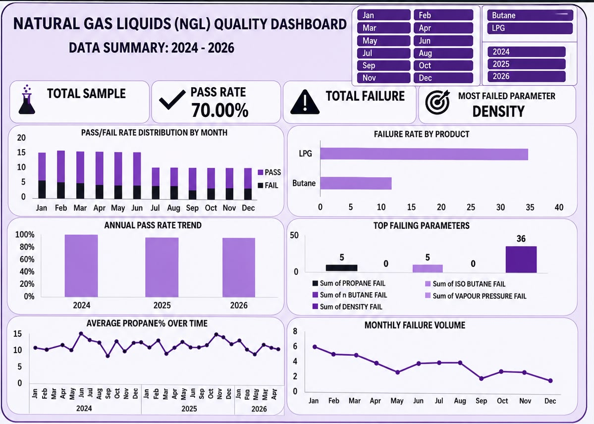

⛽ Natural Gas Liquids (NGL) Production Analysis Dashboard (Excel)

📌 Project Overview

This project analyzes Natural Gas Liquids (NGL) production data through data cleaning, exploratory analysis, and an interactive dashboard built in Microsoft Excel. The project provides insights into production trends, performance patterns, and key metrics within the NGL sector.

🎯 Objectives

* Analyze NGL production trends over time.
* Identify production patterns and key performance indicators.
* Build an interactive dashboard for easy exploration of NGL data.
* Present data driven insights through clear visualizations.

🛠️ Tools & Techniques Used

Microsoft Excel

* Data Cleaning
* Data Transformation
* Descriptive Statistics
* Pivot Tables
* Pivot Charts
* Slicers
* Interactive Dashboard Design

📂 Dataset

The dataset contains NGL production related information used to evaluate production trends and performance.

🔍 Data Cleaning Process

* Removed duplicate records.
* Checked and handled missing values.
* Corrected inconsistent data formats.
* Standardized data for accurate analysis.
* Prepared data for dashboard visualization.

📊 Dashboard Features

* Interactive filters using slicers.
* Production trend analysis.
* Comparative charts and performance metrics.
* Easy to understand visual storytelling.

💡 Key Insights

* Production trends vary across different periods and categories.
* Visual analysis helps identify high and low production periods.
* Interactive dashboards improve data exploration and decision making.

🚀 Skills Demonstrated

* Data Cleaning
* Exploratory Data Analysis (EDA)
* Data Visualization
* Dashboard Development
* Data Storytelling

  ## 📸 Dashboard Preview

